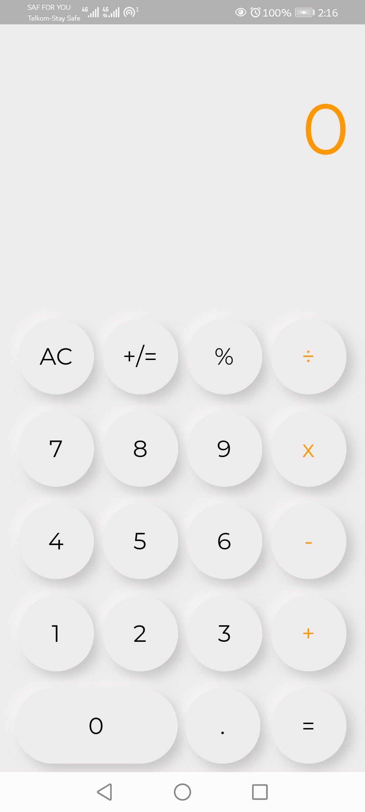

# calculator_app :heavy_multiplication_x::heavy_multiplication_x::heavy_plus_sign:
A Flutter calculator app that can run on both Android and iOS operating systems.

## AUTHOR NAME.
My name is Samuel and I am currently a freelance software programmer .:man_technologist::man_technologist:

## DESCRIPTION OF PROJECT.
The project is a Flutter calculator app that performs all arithmetic operations as any other calculator would do.:medal_military::medal_military::trophy:
 

   
 

### PROJECT SETUP INSTRUCTIONS.
1. Fork this repository.
2. Clone this repository onto your local machine through use of the command `git clone <Forked-repository-link.>`. 
3. Navigate to your terminal.
4. Navigate the the appropriate directory by use of cd command `cd<root-folder>`.
                                                                                                                                                                                                            
## TECHNOLOGIES USED.
#### Main Requirements::signal_strength::high_brightness:
- Dart - The main programming language used.
- Gradle - The main build automation tool used.
- [Android Studio](https://developer.android.com/studio) - The official IDE for creation of android apps.
#### Libraries used::card_index_dividers:
- [flutter_neumorphic](https://pub.dev/packages/flutter_neumorphic) - A complete, ready to use, Neumorphic ui kit for Flutter.
- [flutter_launcher_icons](https://pub.dev/packages/flutter_launcher_icons) - A command-line tool which simplifies the task of updating your Flutter app's launcher icon.

### KNOWN BUGS.:warning:
-----------------------------------

### CONTACT INFORMATION.
For more information, feel free to contact me through the email address: samuelwahome.k5@gmail.com
